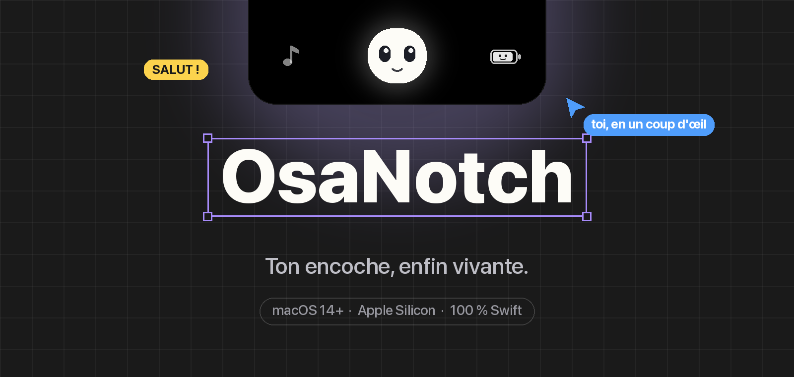
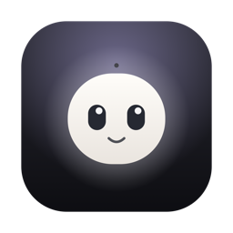

<div align="center">



<br />

**L'encoche de ton MacBook devient un petit compagnon : ta musique et ses paroles,<br />tes fichiers, tes réglages, tes amis et tes IA — en un coup d'œil.**

<br />

<a href="https://notch.osalabs.fr"></a>
&nbsp;
<a href="https://github.com/osayanis/osanotch-native/releases/latest"></a>


</div>

<br />

## 👻 Une mascotte, pas un widget

Au centre de tout, il y a **elle** : une petite boule crème qui vit dans ton encoche.

- Elle **suit ton curseur des yeux** et cligne de temps en temps.
- Elle **danse** quand ta musique joue, **s'inquiète** quand ta batterie est faible, **s'endort** quand le notch est replié.
- Elle te **fait coucou** chaque fois que tu ouvres l'accueil, et t'accueille par ton prénom.

Survole l'encoche : le notch se déploie avec une animation à ressort. Éloigne-toi : il se range. Il passe **au-dessus de la barre de menu**, comme une vraie Dynamic Island.

<br />

## ✨ Ce qu'il sait faire

### 🎵 Musique & paroles synchronisées
Compatible **Apple Music** et **Spotify**. La pochette à gauche ; à droite, les **paroles qui défilent ligne par ligne façon Apple Music**, une barre de progression fluide et les contrôles lecture / pause / piste suivante.
Notch replié, la pochette et un petit égaliseur se collent de chaque côté de l'encoche physique.

### 🔆 HUD volume & luminosité
Les gros carrés gris de macOS disparaissent. À la place, une barre blanche fine glisse **juste sous l'encoche, exactement à sa largeur**. La luminosité ne s'affiche que quand **c'est toi** qui la changes, jamais lors des ajustements automatiques.

### 📎 Presse-papier de fichiers
Glisse un ou plusieurs fichiers sur l'encoche : ils **t'attendent là, même après un redémarrage**.
- Miniatures **Quick Look** (aperçu réel des images, PDF…).
- **Re-glisse** une vignette vers le Bureau ou une app : elle se détache, une carte suit ton curseur, et le fichier quitte l'étagère une fois déposé.
- Clic droit : ouvrir, afficher dans le Finder, copier, AirDrop, retirer.

### 📋 Historique du presse-papier
Tes **20 derniers textes copiés**, un clic pour les recopier. Les mots de passe (contenus marqués confidentiels par les gestionnaires) **ne sont jamais enregistrés**.

### 🗓️ Dashboard
Un mini **miroir caméra**, un **calendrier navigable** avec tes prochains événements, la batterie et un mini-lecteur.

### 🔋 Une batterie qui a des émotions
Une petite pile avec un visage : **souriante** quand tu es chargé, **neutre** à mi-chemin, **inquiète** quand il faut brancher.

### 🤖 Notifications de fin de tâche des IA
OsaNotch remarque quand **Claude Code**, **Claude**, **ChatGPT** ou **Gemini** est en train de générer… et t'affiche **« Claude Code a terminé ✅ »** quand c'est fini. Plus besoin de surveiller ton terminal.

### 🔄 Mises à jour automatiques
L'app vérifie toute seule s'il existe une nouvelle version et s'installe en un clic.

<br />

## 🌐 Connecté à l'écosystème OsaLabs

Le notch embarque les moteurs WebRTC des apps web OsaLabs : **tout est interopérable** entre le notch et le navigateur.

| | App | Dans le notch |
|:-:|---|---|
| 🚀 | [**OsaDrop**](https://osadrop.osalabs.fr) | Envoie un fichier du presse-papier avec un **code à 4 caractères**, ou reçois-en un. Pair-à-pair, sans stockage serveur. |
| 📺 | [**OsaCast**](https://osacast.osalabs.fr) | **Partage ton écran** ou regarde celui d'un ami. Le flux continue même notch replié, et le **mode cinéma ⤢** l'agrandit sur presque tout l'écran. |
| 🎉 | [**OsaParty**](https://osaparty.osalabs.fr) | Crée ou rejoins une **listen party** (code à 6 chiffres) : ton Mac sert de pont Apple Music pour toute la salle. |

<br />

## 📦 Installation

1. Télécharge **[OsaNotch.dmg](https://notch.osalabs.fr)**.
2. Ouvre-le et **glisse l'icône OsaNotch sur le dossier Applications**.
3. Au premier lancement, fais **clic droit → Ouvrir** *(l'app n'est pas notarisée par Apple : ce clic droit est nécessaire une seule fois)*.
4. Laisse-toi guider par l'écran d'accueil pour accorder les autorisations :

| Autorisation | Pourquoi |
|---|---|
| **Accessibilité** | Remplacer le HUD volume/luminosité, détecter les IA en cours de génération |
| **Enregistrement de l'écran** | Diffuser ton écran avec OsaCast |
| **Calendrier** | Afficher tes prochains événements |
| **Caméra** | Le miroir du dashboard |
| **Automatisation** (Music / Spotify) | Lire le titre en cours et piloter la lecture |

> **Configuration requise :** macOS 14 Sonoma ou plus récent, Mac Apple Silicon. Pensé pour les MacBook à encoche (fonctionne aussi sans, en haut de l'écran).

<br />

## 🔔 Brancher tes propres scripts

OsaNotch écoute en local sur le port `8081`. N'importe quel script, agent ou CI peut afficher une bannière dans l'encoche :

```bash
# GET
curl "http://localhost:8081/notify?msg=Build%20terminé%20🚀"

# POST
curl -X POST http://localhost:8081/notify -d '{"msg": "Déploiement OK ✅"}'
```

Le dossier [`AI_Integrations/`](AI_Integrations) contient un script shell prêt à l'emploi et un **userscript Tampermonkey** pour les IA web.

<br />

## 🛠️ Compiler depuis les sources

**Prérequis :** macOS 14+, outils Xcode avec Swift 6.

```bash
git clone https://github.com/osayanis/osanotch-native.git
cd osanotch-native
./build.sh           # compile et assemble OsaNotch.app
open OsaNotch.app
```

| Script | Rôle |
|---|---|
| `build.sh` | `swift build` + assemblage du bundle `.app` + signature (ton certificat Apple Development s'il existe, sinon ad-hoc) |
| `make-dmg.sh` | Fabrique `OsaNotch.dmg`, avec la fenêtre « glisse vers Applications » |
| `publish.sh` | Publie une version : bump, build, `.dmg` + `.zip`, canal de mise à jour et release GitHub *(réservé au mainteneur)* |

<details>
<summary><b>Sous le capot</b></summary>

<br />

- **SwiftUI + AppKit** : un `NSPanel` transparent sans bordure, avec un suivi du curseur à 30 Hz pour déployer et replier l'île.
- **[SkyLightWindow](https://github.com/Lakr233/SkyLightWindow)** : place la fenêtre au-dessus de la barre de menu et des apps plein écran.
- **Ponts WebRTC** : OsaDrop, OsaCast, OsaParty et les amis tournent dans des `WKWebView` invisibles qui réutilisent les moteurs web OsaLabs. Résultat : la même logique et la même compatibilité qu'avec le site.
- **HUD** : un `CGEventTap` intercepte les touches média, et la luminosité passe par `DisplayServices`.
- **Musique** : AppleScript vers Music / Spotify, interpolation locale de la position, paroles synchronisées via [LRCLIB](https://lrclib.net).
- **Presse-papier de fichiers** : `QLThumbnailGenerator` pour les miniatures, `NSItemProvider` pour le glisser sortant.
- **Mises à jour** : flux `latest.json` sur `notch.osalabs.fr`.

```
Sources/OsaNotch/
├── OsaNotchApp.swift      fenêtre, suivi du curseur, tailles de l'île
├── IslandView.swift       l'île : accueil, lecteur, HUD, notifications
├── OsaCharacter.swift     la mascotte (dessinée en Canvas)
├── FileShelf.swift        presse-papier de fichiers
├── OsaDropView.swift      AirDrop · presse-papier · OsaDrop
├── OsaCastView.swift      partage d'écran
├── OsaPartyView.swift     listen party
├── DashboardView.swift    miroir, calendrier, historique du presse-papier
├── SystemData.swift       musique, paroles, batterie, agenda
├── SystemObserver.swift   HUD, OSD natif, serveur de notifications local
├── AITracker.swift        détection des IA en génération
└── *Bridge.swift          ponts WebRTC vers les apps web OsaLabs
```

</details>

<br />

## 💜 Merci

- [**boring.notch**](https://github.com/TheBoredTeam/boring.notch) pour l'inspiration.
- [**SkyLightWindow**](https://github.com/Lakr233/SkyLightWindow) par Lakr233.
- [**LRCLIB**](https://lrclib.net) pour les paroles synchronisées, libres et gratuites.

<br />

<div align="center">



**Fait avec soin par [Yanis](https://github.com/osayanis) · [OsaLabs](https://osalabs.fr)**

<sub>OsaDrop · OsaCast · OsaParty · OsaBoard · OsaNotch</sub>

</div>
